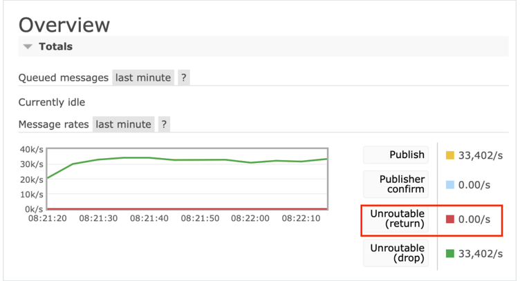

## 학습 자료
- [RabbitMQ 공식문서](https://www.rabbitmq.com/docs/download)
## Docker를 이용하여 RabbitMQ 컨테이너 띄우는 방법

[RabbitMQ 공식문서](https://www.rabbitmq.com/docs/download)를 확인해보면 Docker를 이용해서 RabbitMq, RabbitMq Management(관리자 페이지)를 사용할 수 있도록 컨테이너를 띄울 수 있습니다.<br/>
명령어는 아래와 같습니다.
```shell
docker run -it --rm --name rabbitmq -p 5672:5672 -p 15672:15672 rabbitmq:4-management
```
rabbitMQ 기본 username, password, port는 아래와 같습니다.
- username : guest
- password : guest
- port : 5672


# RabbitMQ
RabbitMQ는 메시징 브로커입니다. 발행자로부터 메시지를 받아 라우팅 하고 라우팅할 큐가 있는 경우 메시지를 소비를 위해 저장하거나 소비자가 있는 경우 메시지를 전달합니다.
AMQP 0-9-1에서는 퍼블리셔가 익스체인지에 메시지를 발행합니다. 퍼블리셔에 따라 다양한 유형을 지원합니다.<br/>
발행 메시지는 큐로 라우티되어야합니다. 메시지가 큐로 성공적으로 라우팅되고 추가 전달을 수락할 수 있는 온라인 상태의 컨슈머가 있는 경우 해당 컨슈머에게 전송됩니다.<br/>
존재하지 않는 큐에 발행을 시도하면 채널 수준 예외가 발생하고 해당 채널이 닫힙니다.

## 퍼블리셔 라이프사이클
발행자는 활성화 되어있는 동안 여러 메시지를 발행합니다. 단일 메시지를 발행하기 위해 연결 또는 채널을 여는 것은 최적의 방법이 아닙니다.<br/>
퍼블리셔는 일반적으로 애플리케이션이 시작 시 연결을 엽니다. 연결은 해당 연결 또는 애플리케이션이 실행되는 동안 유지되는 경우가 많습니다.<br/>
시스템 이벤트에 반응하여 발행을 시작하고 더 이상 필요하지 않을 때 중지하는 등 동적으로 작동할 수 있습니다.

## 프로토콜 차이점
RabbitMQ가 지원하는 프로토콜에서 메시지 발행과정은 유사합니다. 프로토콜 모두 사용자가 페이로드(본문)와 하나 이상의 메시지 속성(헤더)을 포함하는 메시지를 발행할 수 있도록 합니다.<br/>
RabbitMQ가 지원하는 프로토콜은 아래와 같습니다.
- AMQP
- MQTT
- STOMP

### AMQP 0-9-1

메시지 발행은 채널을 통해 익스체인지로 이루어집니다. 익스체인지는 하나 이상의 큐와 익스체인지 간 바인딩을 정의하여 설정된 라우팅 토폴로지를 사용합니다.
성공적으로 라우팅 되는 메시지는 큐에 저장됩니다.<br/>
여러가지 발행 오류가 있으며 프로토콜 기능을 사용하여 처리됩니다.
- 존재하지 않는 익스체인지에 메시지를 발행하려고 하면 오류가 발생하여 채널이 닫히고 그 이후로는 해당 채널에서 더 이상 작업이 허용되지 않습니다.
- 발행된 메시지를 어떤 큐로도 라우팅할 수 없는 경우(e.g. 대상 익스체인지에 대해 정의된 바인딩이 없는 경우) 발행자가 `mandatory` 메시지 속성을 기본값으로 설정하면 폐기 되거나 다른 익스체인지로 다시 발행됩니다.
- 발행된 메시지가 어떤 큐로도 라우팅될 수 없고 발행자가 `mandatory` 메시지 속성을 true로 설정하면 메시지는 발행자에게 반환됩니다. 발행자는 반환된 메시지를 처리하기 위한 반환 메시지 핸들러를 설정해야합니다.(e.g. 오류 로깅 또는 다른 익스체인지를 사용하여 재시도)

### MQTT
MQTT에서 메시지는 토픽에 대한 연결을 통해 발행됩니다. 서버 측 MQTT 연결 프로세스는 토픽 교환을 통해 메시지를 큐로 전달합니다.<br/>
발행자가 QoS를 1을 사용하도록 선택하면 RabbitMQ는 PUBACK 패킷을 사용하여 발행된 메시지를 확인합니다.<br/>
발행자는 서버에 해당 토픽에 발행된 메시지를 보관해야 한다는 힌트를 제공할 수 있습니다. 각 토픽에 대해서는 가장 최근에 발행된 메시지만 보관할 수 있습니다.
MQTT 5.0 PUBACK 패킷에서는 발행 성공 여부를 발행자에게 알려주는 코드가 있습니다. 코드는 아래와 같습니다
- `0 - Success` : 메시지가 전달된 모든 큐에 메시지가 성공적으로 수락
- `16 - No matching subscribers` : RabbitMQ는 해당 토픽 교환에 정의된 바인딩이 없기 때문에 메시지를 어떤 큐로도 라우팅 불가
- `131 - Implementation specific error` : RabbitMQ가 메시지를 거부

(참고 : MQTT 3.1 및 3.1.1 버전에는 연결을 종료하는 것 외에는 서버가 클라이언트에게 발행 오류를 알릴 수 있는 메커니즘이 존재하지 않습니다.)


### STOMP
STOMP 클라이언트는 하나 이상의 대상으로 연결을 통해 메시지를 발행합니다.
서버가 메시지 처리 중 발생한 오류를 발행자에게 알릴 수 잇는 방법을 제공하고 발행자 승인의 변형으로 수신이라는 기능이 있으며 클라이언트는 발행할때 이 기능을 활성화 합니다.

## 라우팅

## 라우팅 불가능한 메시지 처리
클라이언트는 존재하지 않는 대상(익스체인지, 토픽, 큐)으로 메시지를 전송하려고 시도할 수 있습니다. RabbitMQ는 라우팅할 수 없는 메시지를 발행하는 퍼블리셔를 감지하는데 사용할 수 잇는 메트릭을 수집하고 공개합니다.


### AMQP 0-9-1
AMQP 0-9-1 라우팅은 익스체인지를 통해 수행됩니다. 익스체인지는 라우팅 테이블이라고도 합니다.
유형은 아래와 같습니다.
- topic
- fanout
- direct

발행된 메시지를 어떤 큐로도 라우팅할 수 없는 경우 발행자가 mandatory 속성을 기본값(false)으로 설정하면 메시지는 폐기되거나 다른 익스체인지가 존재할 경우 다시 발행됩니다.<br/>
반대로 mandatory 속성을 true로 설정을 하면 발행자에게 반환됩니다. 발행자는 반환된 메시지를 처리하기 위한 반환 메시지 핸들러를 설정해야합니다.
대체 익스체인지는 클라이언트가 익스체인지가 라우팅할 수 없는 메시지(e.g. 바인딩된 큐가 없거나 일치하는 바인딩이 없는 경우)를 처리할 수 있도록 해주는 기능입니다.<br/>
일반적인 예로 클라이언트가 실수 또는 악의적으로 라우팅할 수 없는 메시지를 발행하는 경우 감지하거나 일부 메시지는 특별히 처리하고 나머지는 일반 핸들러로 처리하는 라우팅 의미 체계를 구현하는 경우도 있습니다.

### MQTT
새로운 토픽에 발행하면 해당 토픽에 대한 큐가 생성됩니다. 토픽/QoS 레벨 조합에 따라 서로 다른속성을 가진 큐가 사용됩니다. 따라서 발행자와 소비자가 동일한 QoS 레벨을 사용해야합니다.

### STOMP
STOMP는 기존 토폴리지를 가정하는 경우를 포함하여 어러가지 대상을 지원합니다.
- `/topic` : 아직 구독자가 없는 토픽에 메시지를 발행하면 메시지가 손실될 수 있습니다. 
- `/exchange` : 대상 익스체인지가 존재해야합닏. 그렇지 않을 경우 서버에서 오류 발생합니다.
- `/amq/queue` : 대상 큐가 존재해야합니다. 그렇지 않으면 서버에서 오류가 발생합니다.
- `/queue` : 존재하지 않는 큐에 발생하면 큐가 설정됩니다.
- `/temp-queue` : 존재하지 않는 임시큐에 발행하면 큐가 설정됩니다.

### 측정 기준


발행된 메시지가 라우팅 불가능 메시지로 간주되어 삭제됩니다.

## 프로토콜 별 RabbitMQ 사용하는 방법
RabbitMQ를 사용하는 방법 프로토콜 별로 분리해서 학습을 하려고 합니다.
- [AMQP 모델](https://github.com/cousim46/rabbitmq/tree/main/src/main/java/study/rabbitmq/amqp)


