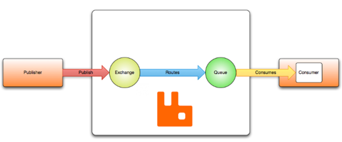
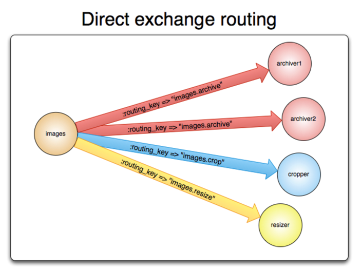
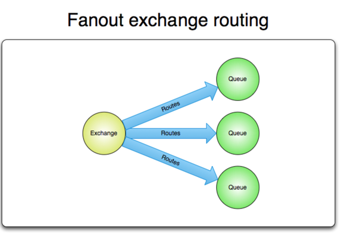

## AMQP o-9-1 모델
AMQP o-9-1은 호환되는 클라이언트 애플리케이션이 호환되는 메시징 미들웨어 브로커와 통신할 수 있도록 하는 메시징 프로토콜입니다.
메시징 브로커는 발행자로부터 메시지를 수신하여 소비자에게 전달합니다. 
메시지는 익스체인지에 발행이 됩니다. 익스체인지는 바인딩이라는 규칙을 사용하여 메시지 복사본을 큐에 배포합니다. 
그런 다음 브로커는 큐를 구독하는 소비자에게 메시지를 전달하거나 소비자가 필요에 따라 큐에서 메시지를 가져옵니다.

메시지를 발행할 때 발행자는 다양한 메시지 속성(메시지 메타 데이터)을 지정할 수 있습니다. 속성 중 일부는 브로커에서 사용되지만 나머지는 브로커에게는 완전히 불투명하며 메시지를 수신하는 소비자 애플리케이션에서만 사용됩니다. 
메시지가 소비자에게 전달되면 소비자는 브로커에게 알림을 보내는데, 이는 자동으로 이루어지거나 애플리케이션 개발자가 원하는 시점에 이루어질 수 있습니다. 
메시지 승인이 사용되는 경우 브로커는 해당 메시지에 대한 알림을 수신해야 큐에서 메시지를 완전히 제거할 수 있습니다. 
메시지를 라우팅할 수 없는 특정 상황에서는 메시지가 발행자에게 반환 되거나, 삭제 또는 브로커가 확장 기능을 구현한 경우 데드 레터 큐에 배치될 수 있습니다. 
(참고 : 큐 익스체인지, 바인딩은 AMQP 엔티티라고 합니다.) 

## 익스체인지
익스체인지는 메시지를 받아 하나 이상의 큐로 라우팅합니다. 
사용되는 라우팅 알고리즘은 익스체인지 유형과 바인딩의 규칙에 따라 달라집니다. 익스체인지 유형은 아래와 같습니다
- Direct
- Fanout
- Topic
- Headers

익스체인지는 속성을 이용해서 선언할 수 있습니다.
- name
- Durability(익스체인지는 브로커 재 시작후에도 유지)
- Auto-delete(마지막 큐가 연결 해제되면 해당 익스체인지 삭제)
- Arguments

익스체인지는 영구적이거나 일시적일수 있습니다. 영구적인 익스체인지는 브로커가 재시작되어도 유지되는 반면 일시적인 익스체인지는 그렇지 않습니다.(브로커가 다시 온라인 상태가 되면 다시 선언해야합니다.)

### 기본 익스체인지
기본 익스체인지는 브로커가 미리 지정한 이름 없는(빈 문자열) Direct Exchange입니다. 이 익스체인지는 간단한 애플리케이션에 바로 생성되는 모든 큐가 이름과 동일한 라우팅 키를 사용하여 자동으로 익스체인지에 연결되는 특별한 속성을 가지고 있습니다. 
예를 들어 "deQueue"라는 이름으로 큐를 선언하면 AMQP 브로커는 "deQueue"를 라우팅 키로 사용하여 해당 큐를 기본 익스체인지에 바인딩합니다.
라우팅 키가 "deQueue"인 상태로 기본 익스체인지에 발행된 메시지는 "deQueue" 큐로 라우팅됩니다. 
RabbitMQ의 기본 익스체인지는 바인딩/언바인딩 작업으로 허용하지 않아 바인딩 작업을 시도하면 오류가 발생합니다.

## Direct Exchange
Direct Exchange는 메시지 라우팅 키를 기반으로 메시지를 큐에 전달합니다. 유니캐스트 메시지 라우팅에 이상적이며 멀티캐스트 라우팅에도 사용할 수 있습니다. 
동작 방식은 아래와 같습니다. 
- 큐는 라우팅 키 K를 사용하여 익스체인지에 연결됩니다.
- 라우팅 키 R을 가진 새 메시지가 Direct Exchange에 도착하면 K와 R이 같을 경우 익스체인지는 해당 메시지를 큐로 라우팅한다.
- 여러 큐가 동일한 라우팅 키 K를 사용하여 Direct Exchange에 연결된 경우 K와 R이 같을 경우 모든 큐로 메시지를 라우팅합니다.

## Fanout Exchange
Fanout Exchange는 자신에게 바인딩 된 모든 큐로 메시지를 라우팅하며 라우팅 키는 무시됩니다. 
N개의 큐가 Fanout Exchange에 바인딩된 경우, 새 메시지가 해당 익스체인지에 발행되면 메시지의 복사본이 N개의 모든 큐로 전달됩니다. Fanout Exchange는 메시지 브로드캐스트 라우팅에 이상적입니다. 

## Topic Exchange
Topic Exchange는 메시지 라우팅 키와 큐를 교환 방식에 바인딩하는데 사용된 패턴 간의 일치 여부를 기반으로 하나 이상의 큐로 메시지를 라우팅합니다.
Topic Exchange는 다양한 발행/구독 패턴 변형을 구현하는데 사용됩니다. 특히 메시지의 멀티캐스트 라우팅에 사용됩니다. 

## Header Exchange
Header Exchange는 라우팅 키보다 메시지 헤더로 표현하기 쉬운 여러 속성을 기반으로 라우팅을 수행하도록 설계되었습니다.
Header Exchange는 라우팅 키 속성을 무시합니다. 
대신 라우팅에 사용되는 속성은 헤더 속성에서 가져옵니다.
헤더 값이 바인딩 시 지정된 값과 같으면 메시지가 일치하는것으로 간주됩니다. 
큐를 Header Exchange에 바인딩할 때 여러 헤더를 일치시키는 방식을 사용할 수 있습니다.
브로커는 애플리케이션 개발자로부터 바로 일치하는 헤더가 하나라도 잇으면 메시지를 처리할지, 모든 헤더가 일치하면 처리할지 지정하는 정보를 받아야합니다. 
"x-match" 바인딩 인수는 이러한 정보를 제공하기 위해 사용됩니다. "x-match" 인수를 "any"로 설정하면 일치하는 헤더 값이 하나라도 있어도 충분하고 "all"로 설정을 하면 모든 값이 일치해야합니다.
"any", "all"로 설정하면 해당 문자열로 시작하는 헤더는 일치 여부를 평가하는데 사용되지 않습니다. "x-match"를 "any-with-x" 또는 "all-with-x"로 설정하면 해당문자열로 시작하는 헤더도 일치 여부를 평가하는데 사용됩니다. 
Header Exchange는 강화된 Direct Exchange로 볼 수 있습니다. 헤더 값 기반으로 라우팅하기 때문에 라우팅 키가 문자열이 아니어도 되는 Direct Exchange 방식으로 사용할 수 있습니다.

## 대기열
AMQP o-9-1 모델의 큐는 다른 메시지 큐 및 태스크 큐 시스템의 큐와 매우 유사합니다. 큐는 애플리케이션에서 소비되는 메시지를 저장합니다.
큐는 익스체인지와 일부 속성을 공유하고 아래와 같이 추가적으로 몇가지 속성을 가지고 있습니다.
- name
- durable(큐는 브로커 재시작 후에도 유지)
- exclusive(하나의 연결에서만 사용되며 해당 연결이 종료되면 큐 삭제)
- auto-delete(최소 한개의 소비자가 구독을 취소하면 큐 삭제)
- arguments

큐를 사용하기 전에 먼저 선언해야합니다. 큐를 선언하면 큐가 존재하지 않을 경우 생성하고 이미 존재하고 해당 큐의 속성이 선언된 속성과 동일한 경우에는 선언하더라도 아무런 영향을 미치지 않습니다.
기존 큐에 선언된 속성과 다른경우에는 채널 레벨 예외 코드 406(PRECONDITION_FAILED)이 발생합니다.

## 큐 이름
애플리케이션은 큐 이름을 직접 선택하거나 브로커에게 이름 생성을 요청할 수 있습니다.
큐 이름은 최대은 최대 255 바이트의 UTF-8 문자로 구성될 수 있습니다. 

## 대기열 지속성
AMQP o-9-1 에서는 큐를 영구 큐(durable queue) 또는 임시 큐(transient queue)로 선언할 수 있습니다. 
영구 큐의 메타데이터는 디스크에 저장되고 임시 큐의 메타데이터는 저장이 가능한 경우 메모리에 저장합니다.

## 바인딩
바인딩은 익스체인지가 메시지를 큐로 라우팅하는데 사용하는 규칙입니다. 
익스체인지가 메시지를 큐로 라우팅하도록 하려면 큐를 익스체인지에 바인딩해야합니다.
바인딩에는 일부 익스체인지 유형에서 사용되는 선택적 라우팅 키 속성이 있습니다. 
라우팅 키의 목적은 익스체인지에 발행된 메시지 중 특정 메시지만 선택하여 바인딩된 큐로 라우팅 하는것입니다. 
메시지를 큐로 라우팅할수없는 경우(e.g. 메시지가 발행된 익스체인지에 대한 바인딩이 없는 경우) 메시지는 발행자가 설정한 메시지 속성에 따라 삭제되거나 발행자에게 반환됩니다.

## 소비자
큐에 메시지를 저장하고 애플리케이션이 저장된 메시지를 소비할 수 없으면 의미가 없습니다.
AMQP o-9-1 모델에서는 애플리케이션이 이를 수행하는 두가지 방법이 있습니다.
- 푸시 API
- 풀 API(폴링)

푸시 API를 사용하면 애플리케이션은 특정 큐에서 메시지를 소비할 의사가 있음을 표시해야합니다.
이렇게 하면 해당 애플리케이션이 소비자를 등록하거나 큐를 구독한다고 합니다.
하나의 큐에 여러개의 소비자를 등록할 수 있고 독점 소비자(해당 큐에서 메시지를 소비하는 동안 다른 소비자를 배제)를 등록할 수 있습니다. 
각 소비자는 소비자 태그라는 식별자를 가지고 있습니다. 이 태그를 사용하여 메시지 구독을 취소할 수 있습니다.

### 메시지 확인
메시지를 수신하고 처리하는 소비자 애플리케이션은 개별 메시지 처리에 실패하거나 서버 연결이 끊어지는 등 여러가지 오류가 발생할 수 있습니다. 
이로 인해 브로커가 큐에서 메시지를 언제 제거해야 하는지에 대해서 소비지가 제어할 수 있는 두가지 승인 모드가 있습니다.
- 브로커가 애플리케이션에 메시지를 보낸 후 또는 basic.deliver, basic.get-ok 방법중 하나 사용
- 애플리케이션이 확인 응답(basic.ack)을 보낸 후 

첫번째는 자동 승인모델이고 두번째는 명시적 승인모델이라고 합니다. 명시적 모델에서는 애플리케이션이 승인 응답을 보낼 시점을 직접 선택할 수 있습니다. 
메시지를 수신한 직후, 처리하기 전에 데이터 저장소에 저장한 후 또는 메시지 처리가 완료된 후에 승인 응답을 보낼 수 있습니다.
소비자가 확인 응답을 보내지 않고 종료되면 브로커는 해당 요청을 다른 소비자에게 재전송하거나, 당시 사용 가능한 소비자가 없는 경우 동일한 큐에 등록된 소비자가 하나이상 나타날때까지 기다린 후 재전송을 시도합니다.

### 메시지 거부
소비자 애플리케이션은 메시지를 수신하면 해당 메시지 처리가 성공할수도 있고 실패할수도 있습니다. 
소비자는 메시지 처리가 실패했거나 또는 현재 처리할 수 없을때 메시지를 거부하여 브로커에게 알릴 수 있습니다.
거부할때 소비자는 브로커에게 해당 메시지를 폐기하거나 다시 큐에 추가하도록 요청할 수 있습니다.
큐에 소비자가 하나만 있는 경우 동일한 소비자로부터 온 메시지를 반복적으로 거부하고 다시 큐에 추가하여 무한 메시지 전달 루프가 발생하지 않도록 주의해야합니다.

### 부정적인 인정
메시지는 basic.reject 메서드를 사용하여 거부됩니다. 
basic.reject 메서드는 승인처럼 여러 메시지를 한번에 거부할 수 있는 방법이 없습니다. 
이를 해결하기 위해 RabbitMQ는 부정 승인이라는 AMQP o-9-1 확장 기능을 제공합니다.

